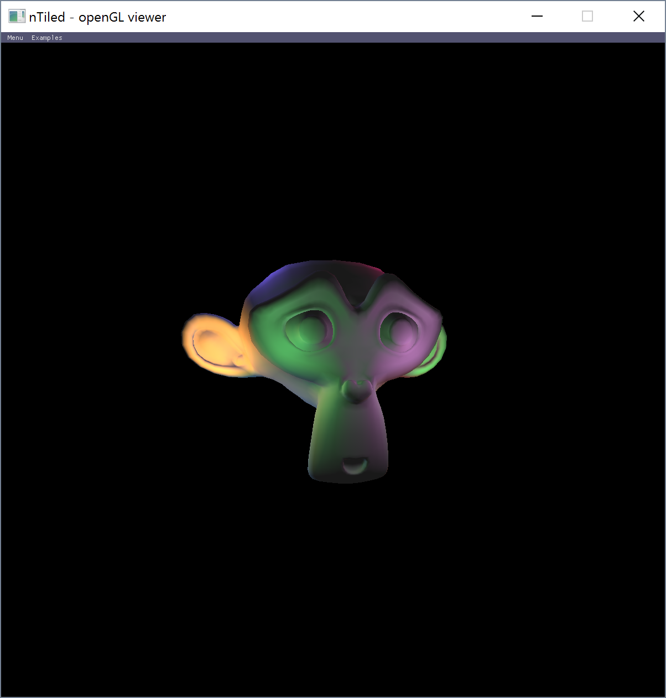

.. _sec-getting_started:

Getting Started
===============

Installation
------------

`nTiled` is developed as a visual studio project. In order to get it running
on your machine you will need the latest visual studio as well as the following
set of dependencies.

Dependencies
~~~~~~~~~~~~
`nTiled` requires the following dependencies:

* `openGL` in the form of `GLAD`
* `glfw` as a windows manager
* `glm` to manage mathematics
* `assimp` to read different 3d files
* `rapidjson` to read json files

Step by step installation
~~~~~~~~~~~~~~~~~~~~~~~~~

#. Install Visual Studio with the installer obtained from `here <https://www.visualstudio.com/downloads/>`_.

#. Clone the `nTiled` repository

    ::
    
        cd <desired parent directory>
        git clone https://github.com/BeardedPlatypus/nTiled.git
      
#. Download dependencies and put them at their relative path

   #. openGL: `glad <https://github.com/Dav1dde/glad>`_
   
      Follow the instructions in the readme of glad to generate the
      appropriate c code and headers.  
      Place these these files at `<solution_directory>/nTiled/lib/>`
   
   #. `glfw <http://www.glfw.org>`_
   
      Download the files from the homepage and put these under
      `<solution_directory>/nTiled/lib/glfw/>`
      If a different version then 3.1.2 is used this needs to be
      updated in the `nTiled` properties
   
   #. `glm <https://github.com/g-truc/glm/releases>`_  
   
      Download the files and put these under
      `<solution_directory>/nTiled/lib/glm/>`
   
   #. `assimp <http://www.assimp.org>`_
   
      Download the files from the homepage and put these under
      `<solution_directory>/nTiled/lib/assimp/>`
   
   #. `rapidjson <https://github.com/miloyip/rapidjson>`_
   
      Follow the installation instructions on the README of rapidjson  

#. You should now be able to start the solution from inside visual studio
   and it should compile.  

   
Basic Usage
-----------

`nTiled` can be run by running the produced executable followed by
the path to a run configuration file.

::

    nTiled <path_to_conf_file.json>

An example run configuration file can be found in the example folder.
This is the same file that will be run when no path is specified.

For other example files see `the data repository <https://github.com/BeardedPlatypus/thesis-data-suite>`_.
For a complete overview of the configuration options see :ref: conf_spec

