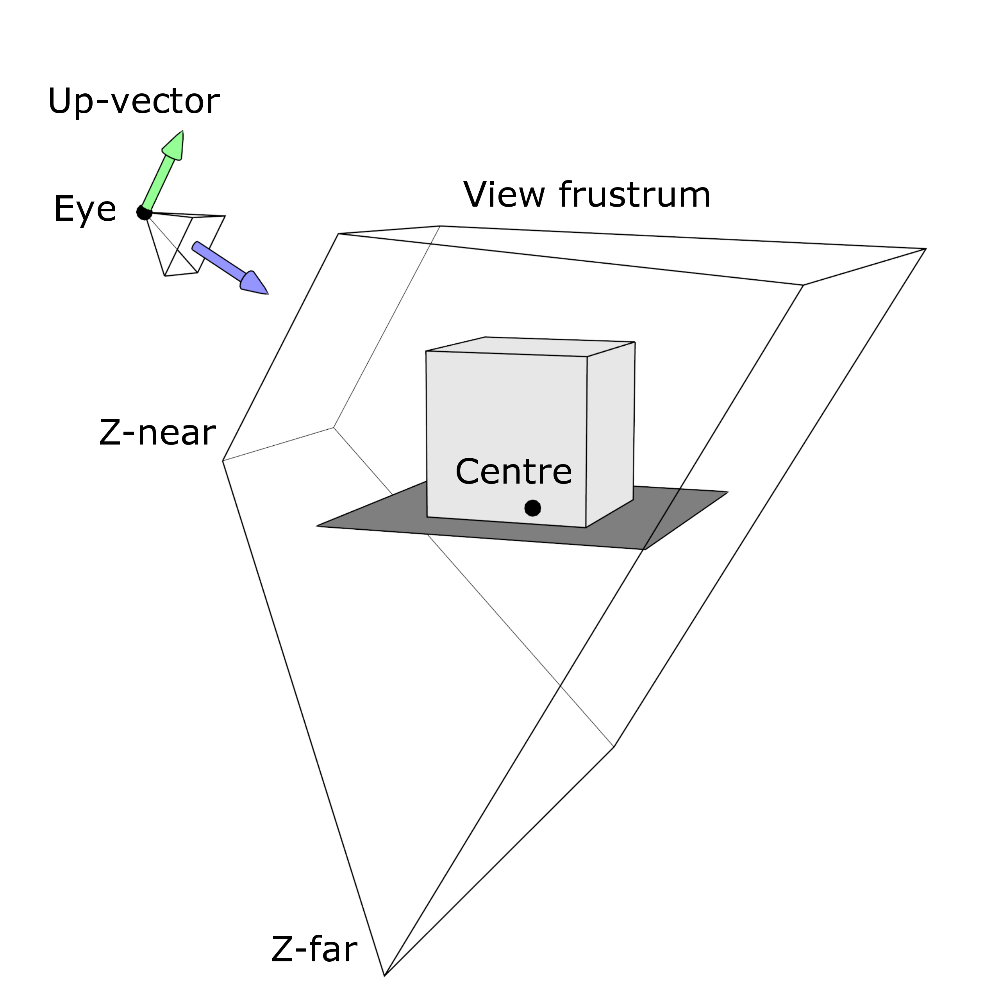

.. _Camera:

Camera
======

The camera module contains all classes and functions related to the Camera
in `nTiled`. The `Camera` class acts as a facade, facilitating interactions
between the rest of the program and the camera module.
The control scheme of the `Camera` is controlled by the CameraControl class.

Camera Model
------------

In order to ensure no errors in communication are made, the following naming 
conventions were adopted within the `camera` module:

The location of the camera is specified by Eye vector. The look at point is
defined by the centre, finally the local y-direction is controlled by the
Up-vector.

Furthermore each camera has a limited space it will display. This space is
controlled by the z-near and z-far values. These in combination
with the field of view and aspect ratio values determine the view frustrum. 

The field of view values are all specified in degrees.
The eye, centre and z-depth values are all defined in world coordinates.

Camera Input
------------

In order to control the Camera the following classes are implemented:
* `TURNTABLE`: allows a direct user controlled input similar to the controls in blender

* `PATH`: Loads a file containing the lookat matrices per frame. It will render these sequentially. 

Camera API
----------

.. toctree::
   :maxdepth: 1

   camera/class_Camera
   camera/class_CameraControl
   camera/struct_CameraConstructionData
   camera/struct_CameraData
